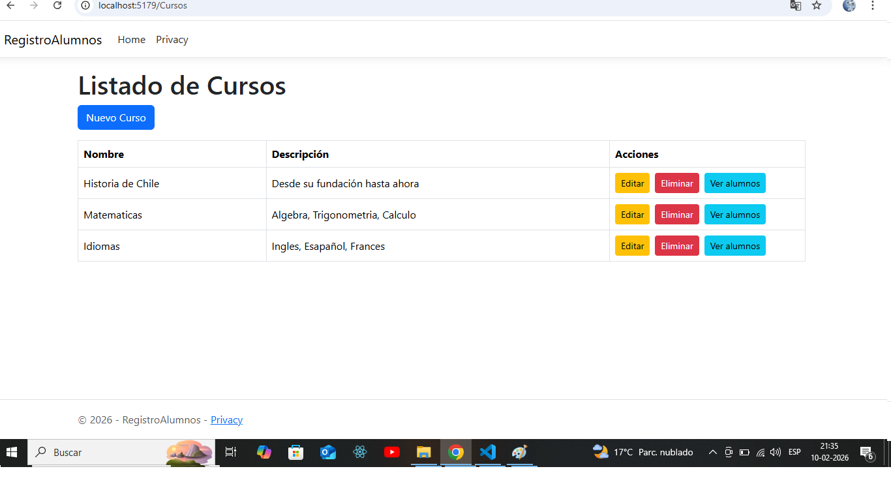
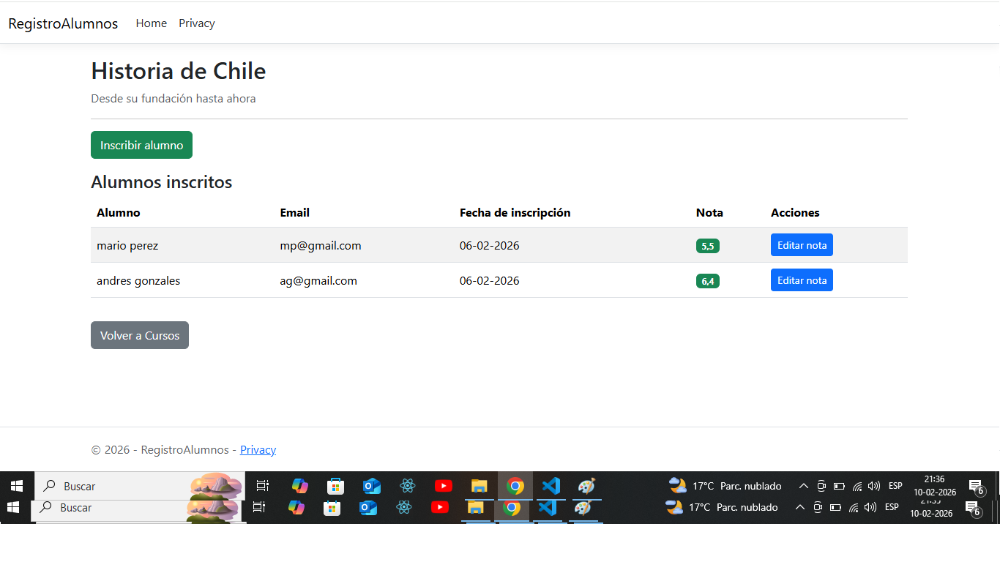
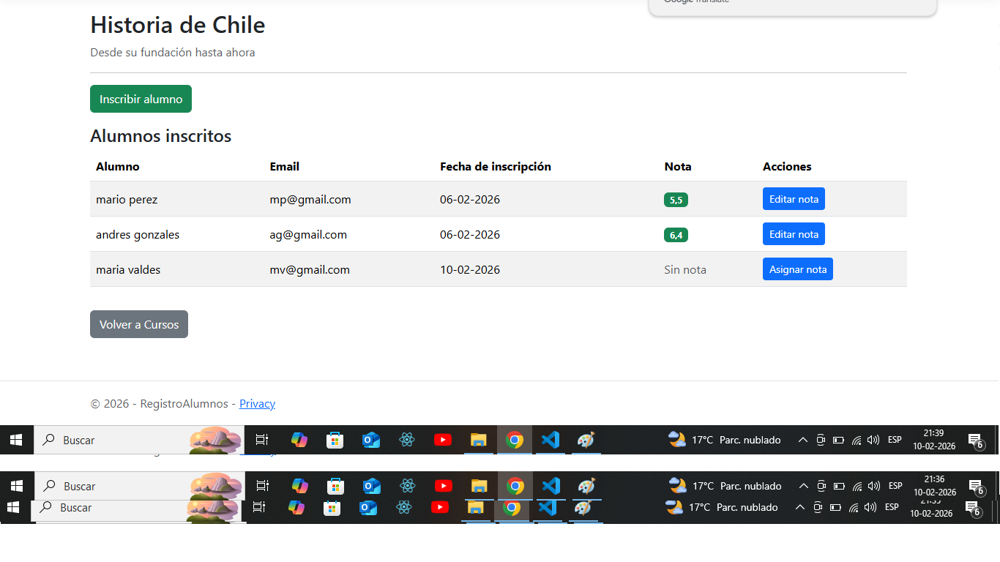

# Registro de Alumnos - ASP.NET Core MVC

Sistema académico para administrar:
- Alumnos
- Cursos
- Inscripciones
- Notas por curso

## Tecnologías
- ASP.NET Core MVC
- Entity Framework Core
- SQL Server
- Razor Views

## Funcionalidades
✅ CRUD Alumnos  
✅ CRUD Cursos  
✅ Inscripción de alumnos  
✅ Asignación y edición de notas  
...

## Cómo Ejecutar

```bash
dotnet run

## 📸 Capturas de Pantalla

### Listado de Cursos


### Alumnos inscritos en un curso


### Asignación de nota / Edicion de nota


```


